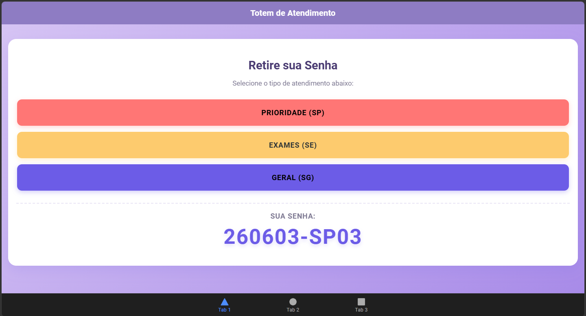
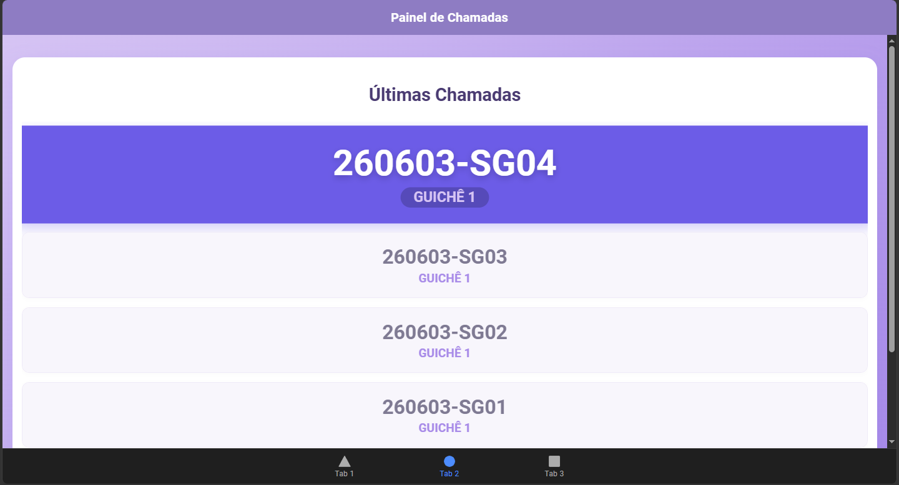
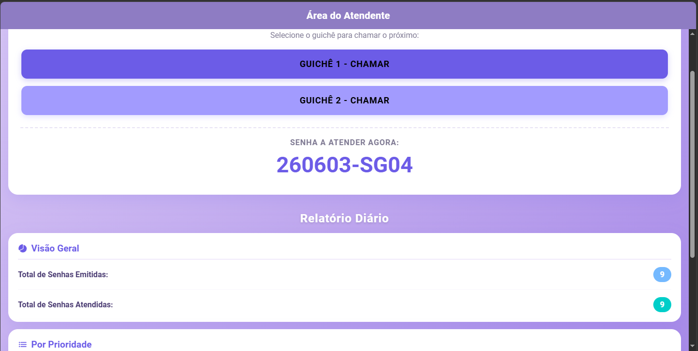

Sistema de Gestão de Filas e Atendimento Médico

Este projeto é uma aplicação de gerenciamento de filas desenvolvida com **Ionic e Angular**. O sistema simula o fluxo de atendimento de um Centro Médico de alto padrão, garantindo organização, justiça na chamada de pacientes e geração de relatórios estatísticos em tempo real para a gestão.


Regras de Negócio e Lógica de Fila

O "cérebro" da aplicação (gerenciado por um *Service* central) foi programado para respeitar rigorosamente as seguintes diretrizes operacionais:

1. **Formatação Inteligente de Senhas:** Cada senha é gerada contendo a data invertida (AAMMDD), o código do tipo de atendimento e um sequencial. Exemplo: `260603-SP01`.
2. **Sistema de Alternância (Anti-Inanição):** Para evitar que os pacientes de exames ou rotina esperem indefinidamente devido ao volume de prioridades, o sistema aplica uma regra de revezamento. Se um paciente Prioritário (SP) for chamado, a próxima chamada buscará obrigatoriamente um paciente de Exames (SE) ou Geral (SG), retornando à prioridade logo em seguida.


Estrutura do Sistema (Interfaces)

A aplicação foi dividida em três frentes de uso para atender a todos os agentes do centro médico:

Guia 1: Totem de Autoatendimento (Paciente)
Interface limpa e intuitiva onde o paciente seleciona a sua necessidade.
**SP:** Prioridade (Idosos, Gestantes, PCD)
**SE:** Exames (Coletas e Resultados)
**SG:** Geral (Consultas de rotina)



Guia 2: Painel de Chamadas - TV (Recepção)
Visão otimizada para telas grandes (modo escuro de alto contraste). 
Exibe a senha chamada no momento em destaque absoluto, emitindo alertas visuais, e mantém o histórico das chamadas anteriores logo abaixo.



Guia 3: Dashboard do Atendente e Relatórios (Gestão)
Painel de controle de uso restrito dos funcionários e gerentes.
**Controle de Guichês:** Botões de ação para os Guichês 1 e 2 solicitarem o próximo paciente da fila.
**Métricas em Tempo Real:** Relatórios automáticos cruzando o total de senhas emitidas contra as atendidas, com detalhamento analítico por categoria (SP, SE e SG).




Tecnologias e Arquitetura Utilizadas

**Framework Mobile/Web:** Ionic Framework
**Framework Front-end:** Angular (com uso estrito de *ngModules*, cumprindo os requisitos de arquitetura modular).
**Linguagem:** TypeScript
**Estilização Visual:** HTML5 e SCSS (Paleta de cores personalizada baseada em tons de lilás e design *Glassmorphism*).


Como Executar o Projeto Localmente

Para rodar este sistema na sua máquina, certifique-se de ter o **Node.js**, **Angular CLI** e **Ionic CLI** instalados.

1. Clone o repositório:
   ```bash
   git clone [COLE_AQUI_O_LINK_DO_GITHUB]
   cd [NOME_DA_SUA_PASTA]
   npm install
   ionic serve

Roteiro de Validação e Testes

Para homologar a lógica do sistema, sugere-se o seguinte fluxo de uso:

Acesse a Guia 1 (Totem) e emita três senhas nesta exata ordem: Prioridade (SP), Prioridade (SP) e Geral (SG).

Navegue até a Guia 3 (Atendente) e repare que o relatório de "Emitidas" contabilizou corretamente as 3 senhas, enquanto as "Atendidas" estão zeradas.

Clique em Chamar (Guichê 1). O sistema chamará o primeiro SP.

Clique em Chamar (Guichê 2). O sistema aplicará a regra de alternância e chamará o SG (saltando o segundo SP temporariamente).

Vá para a Guia 2 (Painel) e verifique se a última senha chamada está em destaque na tela, e o histórico organizado corretamente.

Retorne à Guia 3 e confira o Dashboard atualizado em tempo real com os novos dados de atendimento.